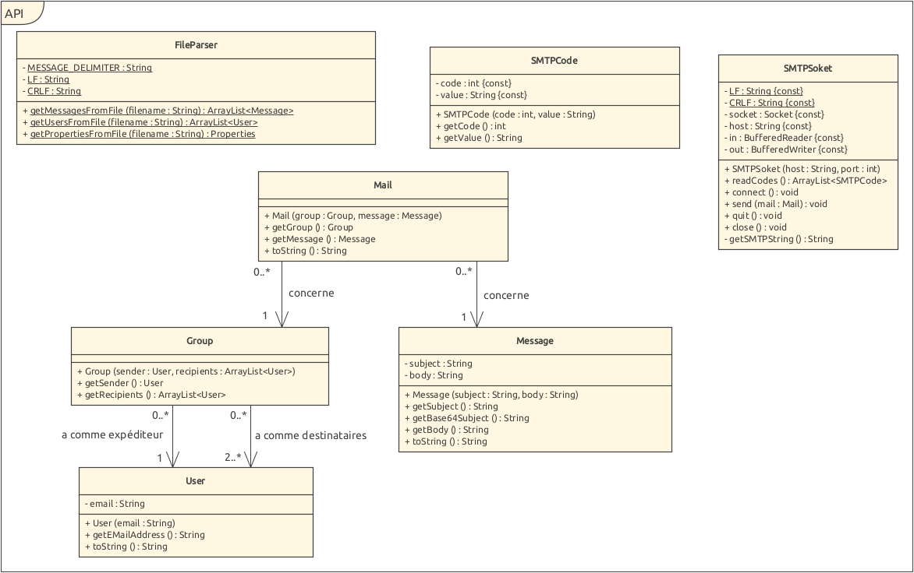

# Laboratoire 04 - API 2021 SMTP
Auteurs : Maxim Golay & Lucien Perregaux

## Description

Ce projet a pour but d'envoyer une campagne de plaisanteries par mail.
L'application est écrite en Java et est entièrement paramétrable via les fichiers de configuration qu'elle offre.
Nous proposons également un serveur SMTP bidon (MockMock), sous la forme d'une image Docker, pour voir le résultat de son exécution.

## Installation du serveur bidon

L'installation du serveur bidon nécessite d'avoir une installation de Docker fonctionnelle au préalable.

***N.B.*** Les scripts fournis sont utilisables directement depuis *Linux* & *MacOS*.  
Pour Windows, veuillez utiliser une couche de compatibilité Linux (tel que *MSYS*) ou utiliser *Docker for WSL*

Le serveur bidon utilise les ports 25 et 8282. Dans le cas où une application utilise un de ceux-ci sur votre machine,
il faudrait idéalement la fermer. Dans l'impossibilité de faire cela, il faut modifier le fichier `docker/run-container.sh`
et modifier le mappage des ports.

Pour installer le serveur,  

1. Naviguer jusqu'au dossier `docker\` à la racine du projet.
2. Lancer le script `build-image.sh` qui va construire l'image Docker du serveur.     
3. Lancer le script `run-container.sh` qui va créer une nouvelle instance de l'image.
 
Avec les scripts dans l'état fourni, les ports 25 et 8282 seront ouverts sur votre machine.
Le premier port permet de communiquer via le protocole SMTP et le second permet de voir, via le protocole HTTP,
le résultat de ces requêtes.

## Configuration de l'application

Le programme a besoin de 3 paramètres, passés par lignes de commande, qui sont les 3 fichiers mentionnés ci-dessous et dans l'ordre dans lequel ils sont mentionnés.

1. settings.properties : Contient les autres paramètres de l'application sous forme de paires `clé=valeur`, à savoir
    - host : Le serveur SMTP à viser, dans le cas où le serveur bidon est mis en place, mettre `localhost`.
    - port : Le port du serveur SMTP, `25` en règle générale.
    - nbgroups : Le nombre de groupes de mail à faire.
2. victims.utf8 : Contient la liste des emails des victimes, séparés par `<[CR]LF>`
3. messages.utf8 : Contient la liste des messages que l'application peut envoyer, séparés par `==<[CR]LF>`.
  Chaque message doit commencer par `Subject: xxx<[CR]LF><[CR]LF>`, où `xxx` est le sujet de l'email.

Un exemple de fichier de configurations se trouve dans le dossier `config` à la racine du projet.

## Fonctionnement

L'application commence par s'assurer qu'il puisse y avoir au moins trois victimes par groupe.
Ensuite, celle-ci créé des groupes aléatoires en choisissant parmi les adresses mails et selon le nombre de groupes
souhaités, celle qui sera l'expéditeur et celles qui seront des destinataires. 
L'algorithme est fait tel qu'une victime n'apparait **qu'une et une seule fois** dans **un et un seul groupe** par campagne.

Enfin, pour chaque groupe, l'*expéditeur* envoie un mail aux *destinataires* choisis préalablement.
Dans le header du mail, le champ `Sender: ` utilisera l'adresse mail de l'expéditeur, usurpant ainsi son identité.

## Diagramme de classes

